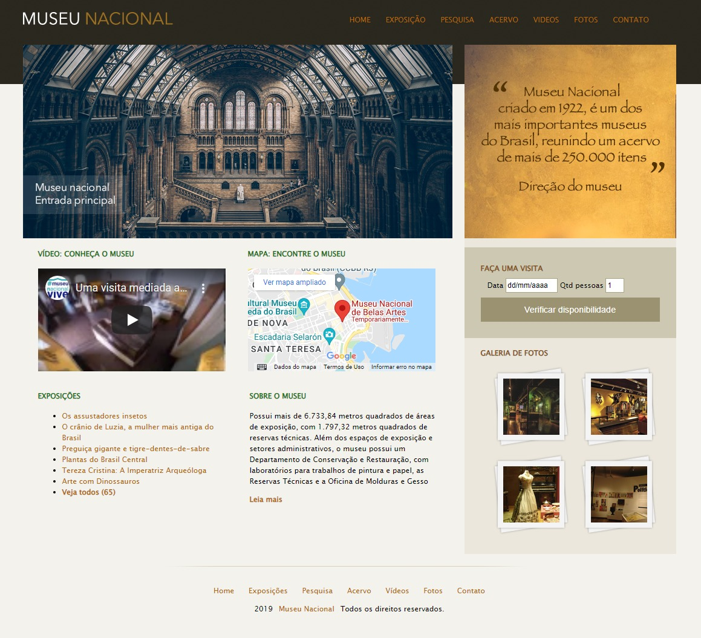

<p style:align: center>
  
</p>
Deletar isso
<p style:align="center">  

     
</p>

<h1 style:align="center">
    
    
</h1>

<br>

## 🧪 Tecnologias

Esse projeto foi desenvolvido com as seguintes tecnologias:

- HTML5
- CSS3
- JavaScript
- Figma

## 🚀 Para clona-lo, siga os passos abaixo:
```bash
$ git clone angeloengcomp/angeloricardotech
```

## 💻 Projeto

angeloricardo.tech é um site pessoal desenvolvido para oferecer serviços de frontend, mais específico em desenvolvimento e manutenção de sites e aplicativos em React Native.
Este site apresenta de que forma trabalho e como é o processo de desenvolvimento do projeto do cliente, desde o orçamento à entrega final do produto.


## 🔖 Deploy

Você pode visualizar o projeto aovivo através do link abaixo:

- [Website](https://www.angeloricardo.tech) 


## 📝 License

Esse projeto está sob a licença MIT. Veja o arquivo [LICENSE](LICENSE.md) para mais detalhes.

---